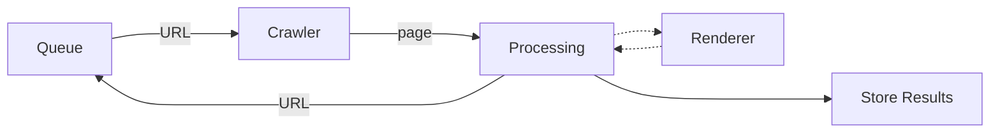

# Scraper that only obtains the HTML contents without evaluating the JS code

Owner: Tim

Recommended code base:
https://github.com/nyu-mlab/k12-school-security-privacy/blob/main/sqlite_school_scraper/src/scraper.py

Objectives: Given the K12 district websites in /raw-input-data, the scraper visits all the home pages and subsequent pages using a simple HTML scraper.

Outputs
`/shared/tim/html-scraper/raw-results/[date]/[district_name]/[pages].db` (as SQLite format)

## Install and run
```bash
# Consider using virtual environments
pip install -e .
python scraper/scrape.py
```

## Develop
```bash
pip install -e .
pip install -e ".[dev]"
pip install -e ".[tests]"
pytest
```

## Concept

